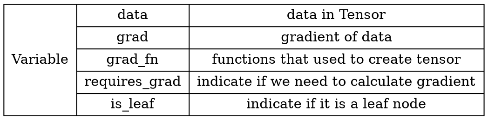

## Pytorch101: Basic ideas about Tensor {ignore=true}
This post aims to introduce some basic ideas about Tensor, which is like a N dimensional matrix. We will first talk about ``Variable``, __how to create tensor__, and some __basic operations__. In the end, we will present an example of a linear regression model to show how to use those functions introduced in this post.
#### Variable
Before ``pytorch 0.4.0`` ``torch.autograd.Variable`` is a individual class built for computing gradients automatically. In later versions, ``torch.autograd.Variable`` and ``torch.Tensor`` are the same class, we can simply use ``torch.Tensor`` to trace the ``Variable``.
There are five major variables in the ``Variable`` class: ``data``, ``grad``, ``grad_fn``, ``requires_grad`` and ``is_leaf``. In addition, there are also another three variables in the ``torch.Tensor`` class: ``dtype``, ``shape``, ``device`` indicating data type (note that ``torch.FloatTensor`` indicate 32-bit floating point while ``torch.DoubleTensor`` is 64-bit), the shape of tensors and where the tensor is stored (cpu/gpu)


The ``grad_fn`` will be used in computing gradient that pytorch use this variable to store what kind of gradient calculation method is used for such specific functions. It is also important to set ``requires_grad==false`` if we don't need to calculate gradient of such tensor, this can save lots of time and memory during training. Basically, the ``requires_grad`` is set to ``false`` in default, but in some implementation, it will then be explicitly changed to ``True``. When we use the codes, it is always a good practice to check whether we need to compute the gradient or not before training.  
#### Create Tensor
Generally, we can create a tensor directly based on raw data by using ``torch.tensor()``. We can also create a tensor by using numpy array or specific distribution (e.g. Gaussian).
```python
# Use torch.tensor() to create a tensor
arr = np.ones((3,3))
print("data type ndarray: ", arr.dtype)
# t = torch.tensor(arr, device="cuda")
t = torch.tensor(arr)
print(t)
```
In addition, we can also use ``torch.from_numpy(ndarray)`` to create tensor, note that when using this function, the created tensor is a reference of the ndarray, namely the ``ndarray`` and the ``torch.data`` have the same address.
```python
arr = np.array([1, 2, 3],[4, 5, 6])
t = torch.from_numpy(arr)
print("numpy array: ", arr)
print("tensor: ", t)

print("\nmodify arr")
arr[0, 0] = 0
print("numpy array: ", arr)
print("tensor: ", t)
# similarly if we change the tensor, the ndarry will be modified accordingly.
# we can also use id() to show the address of arr and t
print("address of t: {},\n address of arr: {}\n".format(id(t), id(arr)))
```
There are some functions in both ``torch`` and ``numpy`` that can generate data with specific values, those data can also be used to create a tensor.

```python
t = torch.zeors(*size, out=None,
                dtype=None,
                layout=torch.strided,
                device=None,
                requires_grad=False)
# out povide a reference
# layout can be set as 'strided' or 'sparse_coo'(for sparse matrix)
out_t = torch.tensor([1])
t = torch.zeros((3,3), out=out_t) # out_t is a reference of t
```
we can also use ``torch.zeros_like(input)`` use the shape of ``input`` to create a tensor with the same shape and 0 values. Similarly, we have ``torch.ones()`` and ``torch.full(size, fill_value)``, ``torch.eye()``. In addition, the ``torch.arange()`` function can be used to create tensor with values in a range [start, end).
```python
# start = 2, end  = 10, step = 2
t = torch.arange(2, 10, 2)
# t would be [2, 4, 6, 8]
```
``torch.linspace`` can create a tensor with uniform values between a range [start, end]. ``torch.logspace()`` is similar to this function.
```python
# param: start, end, length
t = torch.linspace(2, 10, 5)
# t = [2, 4, 6, 8, 10]
# how to calculate the step?
# (end - start) / (length - 1)
# t = torch.linspace(2, 10, 6)
print(t)
```
We can also create a tensor based on a specific distribution, for example, ``torch.normal()`` can be used to create a tensor with values within a gaussian distribution. Note that the ``mean`` and ``std`` of the normal distribution can be a scalar or a tensor. With different dimensions of mean and variance, the created tensor can be total different. We explain this by an example shown as follows:
```python
# mean -> tensor, std -> tensors
mean = torch.arange(1, 5, dtype=torch.float)
std = torch.arange(1, 5, dtype=torch.float)
t_normal = torch.normal(mean, std)
print("mean: {}\n std: {}".format(mean, std))
print(t_normal)
# len(t_normal) will be 4
# and for each element, it is sampled from a normal distribution with different mean and std.

# mean -> scalar, std -> scalar
t_normal = torch.normal(0, 1, size=(4, ))
# note in this case we need to indicate the size explicitly

# mean -> tensor, std -> scalar
mean = torch.arange(1, 5, dtype=torch.float)
std = 1
t_normal(mean, std)
print("mean: {}\n std: {}".format(mean, std))
print(t_normal)
# len(t_normal) will be 4
# and for each element, it is sampled from a normal distribution with different mean but the same std.
```
Beside normal distribution, we can create a tensor from standard normal distribution by using ``torch.randn()``(``torch.randn_like()``) and uniform distribution by using ``torch.rand()`` or ``torch.randint()``. Moreover, ``torch.randperm()`` can be used to generate a tensor with random permutation with a length ``n`` while ``torch.bernoulli(input)`` can generate data within bernoulli distribution where ``input`` is the probability.
